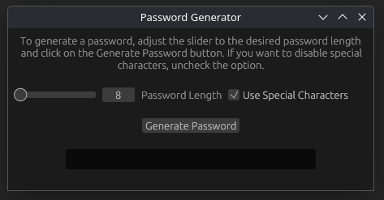

# PasswordGenerator-rs

    

## Description
PasswordGenerator-rs is a simple rust application built with the **egui** GUI library and **eframe** framework.
This application aims to offer a local, offline password generation tool using standard ASCII character codes.
Passwords can be 8 to 24 characters in length and have the option to not use special characters.

> [!note]
> The 24-character limit for the generated password was just an arbitrary choice.
> The max value can be increased to 32 or 50 characters, if need be.
> The 8-character minimum is generally considered the bare minimum for making a password with some experts suggesting it should be at least 12 characters.

This project was created as a means of experimenting with creating a GUI application using Rust.
Rust was selected as a means of exploring creating a desktop application using a low-level language versus using C or C++.
Being new at low-level programming, rust was chosen due to its enforcement on safety.
As I get more comfortable with low-level programming, I could look at remaking this using C/C++.

The egui and eframe packages were chosen for developing the UI as they are written natively with rust instead of using some other language/syntax.

## Usage
This application has a simple user interface.
To generate a password, click on the **Generate Password** button.
To adjust the length of the password, the slider can be adjusted from **8** to **24**.
If you do not want to use special characters (`@`, `&`, `$`, etc.), click on the checkbox for **Use Special Characters**.

These same instructions can also be found on the application's UI.

## Dependency List
The following dependencies are used in this project:

| Dependency | Version | Dependency Status                                                                                           |
|:----------:|:-------:|:------------------------------------------------------------------------------------------------------------|
|   eframe   | 0.34.1  |  |
|    egui    | 0.34.1  |      |
|    rand    | 0.10.1  |      |

## Installation
### Building From Source
> [!important]
> To build from source you need at least cargo version **1.92.0** to support the egui and eframe crates.

To build this project from source, use the following steps:

1. Clone the repository using `git clone`.
2. Change into the project's root directory: `cd passwordgenerator-rs`.
3. Build the project as a release optimization using `cargo build -r`.

For the Windows build, this project is built using `cargo build -r --target x86_64-pc-windows-gnu`, but for building on your own device `cargo build -r` is sufficient.
The build output will be located in `target/release` with the name `passwordgenerator-rs`.

### Pre-Built Binaries
> [!warning]
> This code is currently **unsigned** and may cause issues if running on Windows.

The current stable release has two locally pre-compiled versions of the project:

1. A Linux binary (`passwordgenerator-rs`)
2. A Windows executable (`passwordgenerator-rs.exe`)

> [!note]
> At the time of updating this README, I do not know of (nor have I looked) for a Mac OS build target.

To check the integrity of the executables, a `passwordgenerator-rs.sha256` file is provided with SHA256 checksum values.
Checking the integrity of the binaries, can be performed using `sha256sum -c passwordgenerator-rs.sha256` on Linux and using `Get-FileHash` on Windows using PowerShell.
If on Linux, ensure that the checksum file and the binary are located in the same directory.
If the binary is good, the terminal output will say **OK** along with the package name.

## License
The project is licensed under the **Apache License, Version 2.0**.